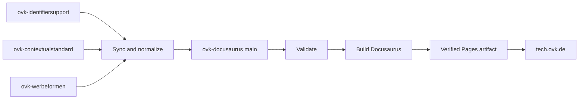

# OVK Tech Specifications

[](https://github.com/BVDW-org/ovk-docusaurus/actions/workflows/build-and-publish.yml)
[](https://github.com/BVDW-org/ovk-docusaurus/actions/workflows/sync-and-publish.yml)

This repository builds and publishes the [OVK technical specifications website](https://tech.ovk.de/). The site combines documentation maintained here with content synchronized from other BVDW/OVK repositories.

> **Important:** the top-level `docs/` directory is legacy generated output. It is no longer the GitHub Pages publishing source. Current deployments use a validated GitHub Pages artifact, so the age shown beside `docs/` in GitHub does not indicate the age of the live website.

## Which section should I read?

- **Content contributor:** start with [Where content comes from](#where-content-comes-from) and [When will a change be live?](#when-will-a-change-be-live).
- **Reviewer:** read [Validation and safety checks](#validation-and-safety-checks).
- **Repository maintainer:** read [The two workflows](#the-two-workflows), [Authentication and permissions](#authentication-and-permissions), and [Troubleshooting](#troubleshooting).
- **Local developer:** follow [Local development](#local-development).

## Publishing at a glance



There are two safe ways to reach the same deployment process:

1. A change under `ovk/` on `main` is validated, built, and deployed.
2. The scheduled sync imports upstream content, commits it only when it changed, validates the synchronized result, builds it, and deploys the exact artifact that passed validation.

The workflows share one concurrency group, so two production deployments cannot race each other.

## Where content comes from

| Source of truth | Published content | Destination in this repository | Live location |
|---|---|---|---|
| [`BVDW-org/ovk-identifiersupport`](https://github.com/BVDW-org/ovk-identifiersupport) | Identity documentation | `ovk/docs/identitysolutions/` | [`/docs/identitysolutions`](https://tech.ovk.de/docs/identitysolutions) |
| [`BVDW-org/ovk-identifiersupport`](https://github.com/BVDW-org/ovk-identifiersupport) | Identifier Landscape tool | `ovk/static/tools/identifier-landscape/` | [`/tools/identifier-landscape/`](https://tech.ovk.de/tools/identifier-landscape/) |
| [`BVDW-org/ovk-contextualstandard`](https://github.com/BVDW-org/ovk-contextualstandard) | Contextual Standard README | `ovk/docs/contextualstandards/index.md` | [`/docs/contextualstandards`](https://tech.ovk.de/docs/contextualstandards) |
| [`BVDW-org/ovk-werbeformen`](https://github.com/BVDW-org/ovk-werbeformen) | Advertising-format documentation | `ovk/docs/werbeformen/` | [`/docs/werbeformen`](https://tech.ovk.de/docs/werbeformen) |
| This repository | Site configuration, navigation, pages, components, and translations | `ovk/` | Various routes |

For synchronized areas, edit the source repository rather than the copied destination. A later sync deliberately makes the destination match its source and may overwrite direct edits.

Repository metadata such as `.git`, `.github`, `.idea`, and `.DS_Store` is never copied into published content. Symbolic links from synchronized documentation are rejected.

## When will a change be live?

### A change in an upstream repository

The **Sync upstream content and publish** workflow runs every hour at minute `23` UTC. A source change should therefore be detected within approximately one hour, plus normal build time.

The sync workflow:

1. checks out all three upstream repositories using `GH_TOKEN`, which should be scoped to read-only access;
2. verifies that required files and Markdown content exist;
3. synchronizes only the intended content and removes files deleted upstream;
4. normalizes known Markdown heading and anchor incompatibilities;
5. commits synchronized source changes, rebasing safely if `main` moved;
6. installs the locked Node.js dependencies;
7. validates the Identifier Landscape configuration;
8. performs a strict production build;
9. pushes the synchronized source commit only after validation succeeds; and
10. deploys the exact artifact produced by that successful build.

A scheduled run with no upstream changes exits without rebuilding or deploying. A manually dispatched run always rebuilds and deploys, even when the synchronized source is already current.

### A change in this repository

A push to `main` that changes `ovk/**` or the build workflow starts **Build and publish OVK Tech Specs** automatically.

Pull requests run the same install, validation, and production-build checks, but they never deploy. A red Dependabot pull-request check therefore does not mean that the current production deployment failed; check the run's event and branch.

## The two workflows

### Build and publish OVK Tech Specs

File: [`.github/workflows/build-and-publish.yml`](.github/workflows/build-and-publish.yml)

Triggers:

- relevant pushes to `main`;
- relevant pull requests; and
- manual `workflow_dispatch` runs.

On `main`, the workflow uploads the verified build as a GitHub Pages artifact and deploys it. On pull requests, it stops after validation and build verification.

### Sync upstream content and publish

File: [`.github/workflows/sync-and-publish.yml`](.github/workflows/sync-and-publish.yml)

Triggers:

- hourly at `23 * * * *` UTC; and
- manual `workflow_dispatch` runs.

The sync script is [`.github/scripts/sync-upstream-content.sh`](.github/scripts/sync-upstream-content.sh). Content-specific normalization is implemented in [`ovk/scripts/normalize-synced-content.mjs`](ovk/scripts/normalize-synced-content.mjs).

The workflow performs its own build and deployment because commits made by GitHub's built-in workflow token do not start another workflow run. This keeps publishing deterministic and avoids duplicate or racing builds.

## Validation and safety checks

Every production artifact must pass all of these checks:

- clean installation from `ovk/package-lock.json` using `npm ci` and Node.js 24;
- Identifier Landscape relationship, duplicate-ID, and reference validation;
- strict Docusaurus builds for the configured locales;
- failure on broken links, broken Markdown links, and broken anchors;
- required `index.html`, `404.html`, and `CNAME` artifact files;
- exact custom-domain value `tech.ovk.de`;
- Git diff whitespace validation before synchronized commits;
- safe rebase/ancestry checks before an automated push; and
- serialized production deployment through the shared `ovk-pages-publisher` concurrency group.

Official GitHub Actions are pinned to immutable commit SHAs. Checkout credentials are removed after use.

### Special characters and URLs

Synchronized files are copied as UTF-8 without transliterating their content. German characters such as `ä`, `ö`, `ü`, and `ß` are supported. Docusaurus URL-encodes spaces and non-ASCII path characters in generated routes.

For a permanent public URL, prefer a stable ASCII `slug` in the document front matter rather than relying on a filename. The strict build catches malformed links and anchors before deployment, while the normalization script handles known upstream heading/anchor patterns deterministically.

## Deployment artifacts versus the legacy `docs/` directory

GitHub Pages is configured with `build_type: workflow`. The live site comes from the temporary artifact uploaded by the successful workflow—not from `main:/docs`, a `gh-pages` branch, or `npm run deploy`.

Consequences:

- publishing does not create large generated-site commits;
- `docs/` timestamps in the repository do not change after a deployment;
- the GitHub Actions run and deployment history are the authoritative freshness indicators; and
- each deployed artifact comes from the exact source state that passed validation.

Use the [Actions page](https://github.com/BVDW-org/ovk-docusaurus/actions) or the response headers from `https://tech.ovk.de/` to check deployment freshness.

## Manual operations

Maintainers with sufficient repository permissions can start either workflow from GitHub's **Actions** tab, or with the GitHub CLI:

```bash
gh workflow run build-and-publish.yml --ref main
gh workflow run sync-and-publish.yml --ref main
gh run list --limit 10
```

Use **Build and publish** when the synchronized source in this repository is already correct and only a fresh deployment is needed. Use **Sync upstream content and publish** when upstream repositories must be checked first.

## Authentication and permissions

The repository secret `GH_TOKEN` is used only to read the three private upstream repositories. It should be a fine-grained token with read-only **Contents** access to those repositories.

The built-in `GITHUB_TOKEN` defaults to read-only repository access. Jobs request additional permission only where required:

- the sync job receives `contents: write` to push a validated synchronized commit; and
- the deployment job receives `pages: write` and `id-token: write` to publish the Pages artifact.

Do not place a personal token in the repository, documentation, workflow files, or Docusaurus client-side environment.

## Local development

Requirements:

- Node.js 24 or newer;
- npm; and
- a checkout of this repository.

```bash
cd ovk
npm ci
node scripts/validate-identifier-config.mjs
npm start
```

The development server prints its local URL and reloads most changes automatically.

Run the production checks before opening a pull request:

```bash
cd ovk
npm ci
node scripts/validate-identifier-config.mjs
npm run build
npm run serve
```

`npm run build` writes ignored local output to `ovk/build/`. Do not copy that output into the top-level `docs/` directory and do not use `npm run deploy`; GitHub Actions owns production deployment.

## Troubleshooting

| Symptom | What to check |
|---|---|
| Upstream change is not live | Confirm it is on the upstream repository's `main` branch, then inspect or manually run **Sync upstream content and publish**. |
| Authentication fails during an upstream checkout | Confirm `GH_TOKEN` exists, has not expired, and has read access to all three source repositories. |
| A pull-request build is red | Open the failed step. Dependency-resolution failures, Markdown failures, and identifier validation failures are intentionally blocked before merge. |
| Production did not deploy after a pull request | Expected: pull requests validate but never deploy. Merge the reviewed change to `main`. |
| `docs/` looks older than the website | Expected: `docs/` is legacy output. Check the latest successful Pages workflow run instead. |
| A URL with spaces or umlauts is difficult to share | Add a stable ASCII front-matter `slug` in the source document and update inbound links. |
| Scheduled sync reports no change | The synchronized destinations already match their upstream sources. No commit or deployment is needed. |
| `main` changes during an automated sync | The workflow stops rather than overwriting newer work. Rerun it to synchronize against the new head. |

## Repository layout

```text
.
├── .github/
│   ├── scripts/                 # Deterministic upstream synchronization
│   └── workflows/               # Validation, synchronization, and Pages deployment
├── docs/                        # Legacy generated site; not a publishing source
└── ovk/
    ├── docs/                    # Docusaurus documentation sources
    ├── scripts/                 # Normalization and configuration validation
    ├── src/                     # Docusaurus pages, components, and styles
    ├── static/                  # Files copied directly into the site artifact
    ├── docusaurus.config.js
    ├── package.json
    └── package-lock.json
```

The live production URL is [https://tech.ovk.de/](https://tech.ovk.de/).
